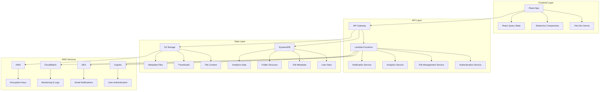
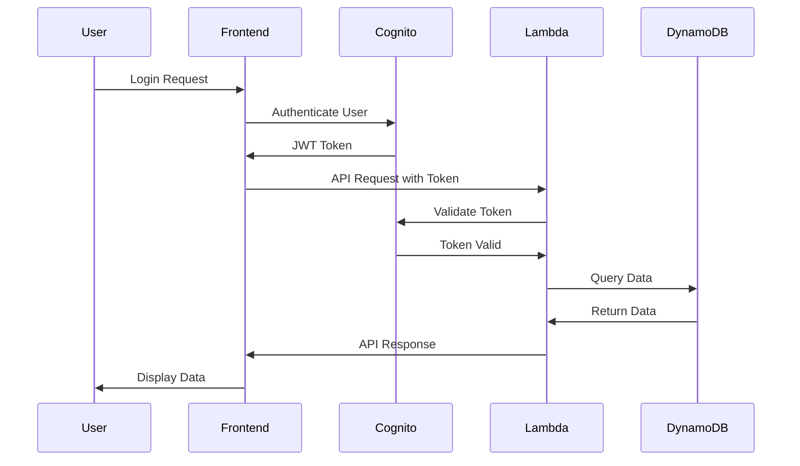

# 🏗️ CloudVault Architecture Overview

## **System Architecture**

CloudVault follows a modern, cloud-native architecture pattern with clear separation of concerns and horizontal scalability.

### **High-Level Architecture**



## **Component Architecture**

### **Frontend Components**

#### **Authentication Layer**
- **AuthService**: Centralized authentication management
- **AuthContext**: React context for auth state
- **AuthGuard**: Route protection component
- **LoginForm**: User login interface
- **RegisterForm**: User registration interface

#### **Dashboard Layer**
- **DashboardLayout**: Main application layout
- **AppSidebar**: Navigation sidebar
- **DashboardHeader**: Top navigation bar
- **FileManager**: File management interface
- **UploadDialog**: File upload modal

#### **Service Layer**
- **S3Service**: S3 operations and file management
- **DynamoService**: DynamoDB operations
- **LambdaService**: Lambda function interactions
- **AuthService**: Authentication operations

### **Backend Architecture**

#### **Lambda Functions**

##### **File Processing Service**
```typescript
interface FileProcessingService {
  processFile(fileId: string, s3Key: string): Promise<ProcessingResult>;
  generateThumbnail(fileId: string): Promise<string>;
  extractMetadata(fileId: string): Promise<FileMetadata>;
  validateFileType(fileId: string): Promise<boolean>;
}
```

**Capabilities:**
- Image thumbnail generation
- EXIF data extraction
- File hashing (SHA-256)
- MIME type validation
- Virus scanning integration

##### **Folder Management Service**
```typescript
interface FolderManagementService {
  createFolder(request: CreateFolderRequest): Promise<FolderResponse>;
  listFolders(userEmail: string): Promise<Folder[]>;
  updateFolder(folderId: string, updates: FolderUpdates): Promise<Folder>;
  deleteFolder(folderId: string): Promise<boolean>;
}
```

**Capabilities:**
- Hierarchical folder structure
- Permission management
- Soft delete functionality
- Bulk operations

##### **Analytics Service**
```typescript
interface AnalyticsService {
  trackEvent(event: AnalyticsEvent): Promise<void>;
  getUsageStats(userEmail: string): Promise<UsageStats>;
  generateReport(reportType: string): Promise<Report>;
  getPerformanceMetrics(): Promise<PerformanceMetrics>;
}
```

**Capabilities:**
- Real-time event tracking
- User behavior analytics
- Storage usage monitoring
- Performance metrics

##### **Notification Service**
```typescript
interface NotificationService {
  sendEmail(notification: EmailNotification): Promise<void>;
  sendSMS(notification: SMSNotification): Promise<void>;
  sendPush(notification: PushNotification): Promise<void>;
  scheduleNotification(notification: ScheduledNotification): Promise<void>;
}
```

**Capabilities:**
- Email notifications (SES)
- SMS notifications (SNS)
- Push notifications
- Template management

## **Data Architecture**

### **DynamoDB Table Design**

#### **Users Table**
```yaml
TableName: CloudVault-Users-{env}
PartitionKey: email (String)
SortKey: id (String)
GSI:
  - IndexName: company-index
    PartitionKey: company (String)
    SortKey: createdAt (String)
```

#### **Folders Table**
```yaml
TableName: CloudVault-Folders-{env}
PartitionKey: userEmail (String)
SortKey: id (String)
GSI:
  - IndexName: parentId-index
    PartitionKey: parentId (String)
    SortKey: createdAt (String)
```

#### **Files Table**
```yaml
TableName: CloudVault-Files-{env}
PartitionKey: userEmail (String)
SortKey: id (String)
GSI:
  - IndexName: folderId-index
    PartitionKey: folderId (String)
    SortKey: uploadedAt (String)
```

### **S3 Storage Structure**

```
cloudvault-storage-{env}/
├── .metadata/
│   ├── folders/
│   │   └── {userEmail}/
│   │       └── {folderId}.json
│   └── files/
│       └── {userEmail}/
│           └── {fileId}.json
├── {userEmail}/
│   ├── Root/
│   │   ├── {fileId}/
│   │   │   ├── original/
│   │   │   ├── thumbnails/
│   │   │   └── metadata.json
│   │   └── {folderId}/
│   └── {folderId}/
│       └── {fileId}/
└── shared/
    └── {shareId}/
        └── {fileId}/
```

## **Security Architecture**

### **Authentication Flow**



### **Authorization Model**

#### **Role-Based Access Control (RBAC)**
```typescript
enum UserRole {
  ADMIN = 'admin',
  USER = 'user',
  VIEWER = 'viewer'
}

interface Permission {
  resource: string;
  actions: string[];
  conditions?: Record<string, any>;
}
```

#### **Resource Permissions**
- **Files**: Read, Write, Delete, Share
- **Folders**: Read, Write, Delete, Manage
- **Analytics**: Read, Export
- **Settings**: Read, Write

## **Scalability Architecture**

### **Horizontal Scaling**

#### **Lambda Auto-Scaling**
- **Concurrent Executions**: 1000+ per function
- **Provisioned Concurrency**: For predictable workloads
- **Reserved Concurrency**: For critical functions

#### **DynamoDB Auto-Scaling**
- **Read Capacity**: Auto-scaling based on demand
- **Write Capacity**: Auto-scaling based on demand
- **On-Demand**: For unpredictable workloads

#### **S3 Scaling**
- **Storage**: Unlimited capacity
- **Requests**: 11,000 PUT/COPY/POST/DELETE per second
- **GET**: 5,500 GET/HEAD per second

### **Performance Optimization**

#### **Caching Strategy**
- **CloudFront**: Global content delivery
- **DynamoDB DAX**: In-memory caching
- **Lambda Layers**: Shared code caching
- **S3 Transfer Acceleration**: Faster uploads

#### **Database Optimization**
- **Partition Key Design**: Even data distribution
- **GSI Design**: Efficient query patterns
- **Batch Operations**: Reduced API calls
- **Projection Expressions**: Reduced data transfer

## **Monitoring Architecture**

### **CloudWatch Integration**

#### **Custom Metrics**
- **Application Metrics**: Request count, latency, errors
- **Business Metrics**: User registrations, file uploads
- **Infrastructure Metrics**: CPU, memory, disk usage

#### **Logging Strategy**
- **Structured Logging**: JSON format with correlation IDs
- **Log Levels**: ERROR, WARN, INFO, DEBUG
- **Log Retention**: 30 days for INFO, 90 days for ERROR
- **Log Aggregation**: CloudWatch Logs Insights

#### **Alerting**
- **Error Rate**: > 5% for 5 minutes
- **Latency**: > 2 seconds for 5 minutes
- **Storage Usage**: > 80% of allocated space
- **Failed Logins**: > 10 attempts in 5 minutes

## **Deployment Architecture**

### **Infrastructure as Code (IaC)**

#### **AWS CDK Stack Structure**
```
lib/
├── cloudvault-stack.ts          # Main stack
├── constructs/
│   ├── auth-construct.ts        # Cognito setup
│   ├── storage-construct.ts     # S3 + DynamoDB
│   ├── api-construct.ts         # API Gateway + Lambda
│   ├── monitoring-construct.ts  # CloudWatch + X-Ray
│   └── security-construct.ts    # IAM + KMS + WAF
├── environments/
│   ├── dev.ts
│   ├── staging.ts
│   └── prod.ts
└── bin/
    └── cloudvault.ts
```

#### **Environment Configuration**
```typescript
interface EnvironmentConfig {
  account: string;
  region: string;
  environment: 'dev' | 'staging' | 'prod';
  domain: string;
  certificateArn: string;
  vpcId?: string;
  subnetIds?: string[];
  allowedCorsOrigins: string[];
  retentionDays: number;
  backupRetentionDays: number;
}
```

### **CI/CD Pipeline**

#### **GitHub Actions Workflow**
```yaml
name: CloudVault Deployment
on:
  push:
    branches: [main, develop]
  pull_request:
    branches: [main]

jobs:
  test:
    runs-on: ubuntu-latest
    steps:
      - uses: actions/checkout@v3
      - uses: actions/setup-node@v3
      - run: npm ci
      - run: npm run test
      - run: npm run lint
      - run: npm run type-check

  build:
    needs: test
    runs-on: ubuntu-latest
    steps:
      - uses: actions/checkout@v3
      - uses: actions/setup-node@v3
      - run: npm ci
      - run: npm run build
      - run: npm run build:lambda

  deploy-dev:
    needs: build
    if: github.ref == 'refs/heads/develop'
    runs-on: ubuntu-latest
    steps:
      - uses: actions/checkout@v3
      - uses: aws-actions/configure-aws-credentials@v2
      - run: cdk deploy CloudVault-Dev --require-approval never

  deploy-prod:
    needs: build
    if: github.ref == 'refs/heads/main'
    runs-on: ubuntu-latest
    steps:
      - uses: actions/checkout@v3
      - uses: aws-actions/configure-aws-credentials@v2
      - run: cdk deploy CloudVault-Prod --require-approval never
```

## **Disaster Recovery Architecture**

### **Backup Strategy**

#### **Data Backup**
- **S3 Cross-Region Replication**: Automatic backup
- **DynamoDB Point-in-Time Recovery**: 35-day retention
- **Lambda Function Versioning**: Code backup
- **Configuration Backup**: CDK code in Git

#### **Recovery Procedures**
- **RTO (Recovery Time Objective)**: 4 hours
- **RPO (Recovery Point Objective)**: 1 hour
- **Multi-Region Deployment**: Active-passive setup
- **Automated Failover**: Route 53 health checks

### **High Availability**

#### **Multi-AZ Deployment**
- **DynamoDB**: Multi-AZ by default
- **S3**: Cross-region replication
- **Lambda**: Multi-region deployment
- **API Gateway**: Global service

#### **Health Checks**
- **Application Health**: Custom health endpoints
- **Infrastructure Health**: AWS health checks
- **Database Health**: DynamoDB health checks
- **Storage Health**: S3 health checks

## **Cost Optimization**

### **Cost Management Strategies**

#### **Storage Optimization**
- **S3 Lifecycle Policies**: Automatic archival and deletion
- **DynamoDB On-Demand**: Pay-per-request pricing
- **Lambda Provisioned Concurrency**: For predictable workloads
- **CloudFront**: Global content delivery

#### **Estimated Monthly Costs (1000 users)**
- **S3 Storage**: $50-100
- **DynamoDB**: $30-60
- **Lambda**: $20-40
- **API Gateway**: $10-20
- **Cognito**: $5-10
- **CloudWatch**: $10-20
- **Total**: $125-250/month

## **Future Architecture Considerations**

### **Planned Enhancements**

#### **Microservices Migration**
- **Service Mesh**: Istio or AWS App Mesh
- **API Gateway**: Multiple gateways per service
- **Event-Driven Architecture**: EventBridge integration
- **CQRS Pattern**: Command Query Responsibility Segregation

#### **Advanced Features**
- **Real-time Collaboration**: WebSocket integration
- **AI/ML Integration**: File analysis and recommendations
- **Blockchain Integration**: File integrity verification
- **Edge Computing**: Lambda@Edge for global performance

---

This architecture provides a solid foundation for building and scaling CloudVault as an enterprise-grade file management system with proper separation of concerns, scalability, and maintainability.
